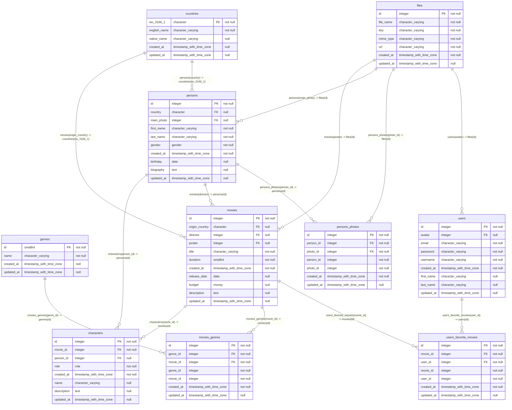

## DB Schema

```mermaid
erDiagram

    characters {
        id integer PK "not null"
        movie_id integer FK "not null"
        person_id integer FK "null"
        role role "not null"
        created_at timestamp_with_time_zone "not null"
        name character_varying "null"
        description text "null"
        updated_at timestamp_with_time_zone "null"
    }

    countries {
        iso_3166_1 character PK "not null"
        english_name character_varying "not null"
        native_name character_varying "null"
        created_at timestamp_with_time_zone "null"
        updated_at timestamp_with_time_zone "null"
    }

    files {
        id integer PK "not null"
        file_name character_varying "not null"
        key character_varying "not null"
        mime_type character_varying "not null"
        url character_varying "not null"
        created_at timestamp_with_time_zone "not null"
        updated_at timestamp_with_time_zone "null"
    }

    genres {
        id smallint PK "not null"
        name character_varying "not null"
        created_at timestamp_with_time_zone "null"
        updated_at timestamp_with_time_zone "null"
    }

    movies {
        id integer PK "not null"
        origin_country character FK "null"
        director integer FK "null"
        poster integer FK "null"
        title character_varying "not null"
        duration smallint "not null"
        created_at timestamp_with_time_zone "not null"
        release_date date "null"
        budget money "null"
        description text "null"
        updated_at timestamp_with_time_zone "null"
    }

    movies_genres {
        id integer PK "not null"
        genre_id integer FK "not null"
        movie_id integer FK "not null"
        genre_id integer "not null"
        movie_id integer "not null"
        created_at timestamp_with_time_zone "not null"
        updated_at timestamp_with_time_zone "null"
    }

    persons {
        id integer PK "not null"
        country character FK "null"
        main_photo integer FK "null"
        first_name character_varying "not null"
        last_name character_varying "not null"
        gender gender "not null"
        created_at timestamp_with_time_zone "not null"
        birthday date "null"
        biography text "null"
        updated_at timestamp_with_time_zone "null"
    }

    persons_photos {
        id integer PK "not null"
        person_id integer FK "not null"
        photo_id integer FK "not null"
        person_id integer "not null"
        photo_id integer "not null"
        created_at timestamp_with_time_zone "not null"
        updated_at timestamp_with_time_zone "null"
    }

    users {
        id integer PK "not null"
        avatar integer FK "null"
        email character_varying "not null"
        password character_varying "not null"
        username character_varying "not null"
        created_at timestamp_with_time_zone "not null"
        first_name character_varying "null"
        last_name character_varying "null"
        updated_at timestamp_with_time_zone "null"
    }

    users_favorite_movies {
        id integer PK "not null"
        movie_id integer FK "not null"
        user_id integer FK "not null"
        movie_id integer "not null"
        user_id integer "not null"
        created_at timestamp_with_time_zone "not null"
        updated_at timestamp_with_time_zone "null"
    }

    countries ||--o{ movies : "movies(origin_country) -> countries(iso_3166_1)"
    countries ||--o{ persons : "persons(country) -> countries(iso_3166_1)"
    files ||--o{ movies : "movies(poster) -> files(id)"
    files ||--o{ persons : "persons(main_photo) -> files(id)"
    files ||--o{ persons_photos : "persons_photos(photo_id) -> files(id)"
    files ||--o{ users : "users(avatar) -> files(id)"
    genres ||--o{ movies_genres : "movies_genres(genre_id) -> genres(id)"
    movies ||--o{ characters : "characters(movie_id) -> movies(id)"
    movies ||--o{ movies_genres : "movies_genres(movie_id) -> movies(id)"
    movies ||--o{ users_favorite_movies : "users_favorite_movies(movie_id) -> movies(id)"
    persons ||--o{ characters : "characters(person_id) -> persons(id)"
    persons ||--o{ movies : "movies(director) -> persons(id)"
    persons ||--o{ persons_photos : "persons_photos(person_id) -> persons(id)"
    users ||--o{ users_favorite_movies : "users_favorite_movies(user_id) -> users(id)"
```
